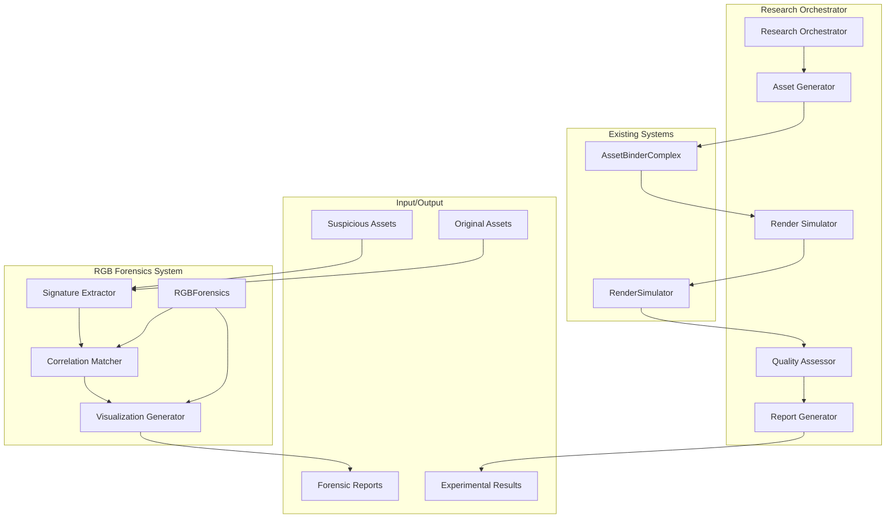

# Design Document

## Overview

The RGB Forensics Traitor Tracing System is a comprehensive digital forensics framework designed to identify unauthorized users who have stolen or misused texture assets. The system leverages ratio test analysis to extract unique noise signatures from suspicious assets and correlates them with known user patterns to identify traitors.

The system consists of two main components:
1. **RGBForensics Class**: Implements signature extraction and correlation matching for traitor identification
2. **Research Orchestrator**: Provides end-to-end experimental pipeline for validation and academic research

The design integrates seamlessly with the existing AssetBinderComplex and RenderSimulator systems to provide a complete traitor tracing solution.

## Architecture

### System Components



### Data Flow Architecture

The system follows a pipeline architecture where data flows through distinct processing stages:

1. **Input Stage**: Load suspicious and original texture assets
2. **Extraction Stage**: Apply ratio test to extract noise signatures
3. **Correlation Stage**: Match signatures against known user patterns
4. **Visualization Stage**: Generate forensic reports and charts
5. **Validation Stage**: Run experimental pipelines for system validation

### Integration Points

The system integrates with existing components:
- **AssetBinderComplex**: Used to regenerate expected noise patterns for correlation
- **RenderSimulator**: Used for rendering test scenarios and quality assessment
- **File System**: For loading assets and saving forensic reports

## Components and Interfaces

### RGBForensics Class

**Purpose**: Main forensics analysis class implementing signature extraction and traitor identification

**Key Methods**:
```python
class RGBForensics:
    def extract_signature(self, suspicious_albedo_path: str, original_clean_path: str) -> np.ndarray
    def find_traitor(self, signature: np.ndarray, max_users: int = 100) -> int
    def visualize_results(self, scores: np.ndarray, detected_uid: int) -> None
```

**Signature Extraction Algorithm**:
1. Load suspicious and original albedo textures
2. Apply ratio test: `Noise_Pattern = Suspicious / (Original + epsilon)`
3. Handle black pixels by masking or setting ratio to 1.0
4. Fuse RGB channels by averaging: `signature_2d = mean(noise_pattern, axis=2)`
5. Normalize signature: `(Signature - Mean) / StdDev`

**Correlation Matching Algorithm**:
1. Initialize AssetBinderComplex for noise generation
2. For each user ID from 0 to max_users:
   - Generate expected noise block map using user seed
   - Normalize expected map using same normalization as signature
   - Compute correlation score: `sum(Signature * Expected)`
3. Return user ID with highest correlation score

### Signature Extractor Component

**Input Interface**:
- `suspicious_albedo_path`: Path to suspicious texture file
- `original_clean_path`: Path to original clean texture file

**Output Interface**:
- `signature`: Normalized 2D numpy array representing noise pattern

**Processing Logic**:
- Implements robust ratio test with epsilon protection
- Handles edge cases (black pixels, division by zero)
- Performs RGB channel fusion and statistical normalization

### Correlation Matcher Component

**Input Interface**:
- `signature`: Extracted signature array
- `max_users`: Maximum number of users to test

**Output Interface**:
- `user_id`: Detected traitor user ID
- `scores`: Array of correlation scores for all tested users

**Processing Logic**:
- Regenerates expected noise patterns using AssetBinderComplex logic
- Applies consistent normalization across all patterns
- Computes vectorized correlation scores for efficiency

### Visualization Generator Component

**Input Interface**:
- `scores`: Array of correlation scores
- `detected_uid`: Identified traitor user ID

**Output Interface**:
- `forensic_report.png`: Matplotlib bar chart visualization

**Visualization Features**:
- Bar chart with user IDs on x-axis and correlation scores on y-axis
- Highlighted bar for detected traitor
- Professional formatting with titles and labels
- Saved as high-resolution PNG file

### Research Orchestrator Component

**Purpose**: Coordinates complete experimental pipeline for system validation

**Key Methods**:
```python
class ResearchOrchestrator:
    def setup_experiment(self) -> Tuple[np.ndarray, np.ndarray]
    def generate_test_assets(self, victim_id: int, attacker_id: int) -> None
    def run_simulation_scenarios(self) -> Tuple[np.ndarray, np.ndarray]
    def perform_forensic_analysis(self) -> int
    def generate_report(self, metrics: dict) -> None
```

**Experimental Pipeline**:
1. **Setup**: Create dummy original assets using skimage.data.astronaut()
2. **Generation**: Generate bound assets for victim (ID 42) and attacker (ID 99)
3. **Simulation**: Render legitimate and attack scenarios
4. **Forensics**: Analyze bound albedo to detect victim ID
5. **Reporting**: Generate LaTeX-compatible results table

## Data Models

### Signature Data Model

```python
@dataclass
class ForensicSignature:
    signature: np.ndarray          # Normalized 2D signature array
    dimensions: Tuple[int, int]    # Height, width of signature
    normalization_params: dict     # Mean, std dev for denormalization
    extraction_metadata: dict      # Source files, parameters used
```

### Correlation Results Data Model

```python
@dataclass
class CorrelationResults:
    user_scores: np.ndarray        # Correlation scores for all users
    detected_user_id: int          # User ID with highest score
    confidence_score: float        # Highest correlation score
    analysis_metadata: dict        # Parameters, timestamp, etc.
```

### Experimental Results Data Model

```python
@dataclass
class ExperimentResults:
    legitimate_metrics: dict       # PSNR, SSIM for legitimate scenario
    attack_metrics: dict          # PSNR, SSIM for attack scenario
    forensic_detection: int       # Detected user ID from forensics
    detection_accuracy: bool      # Whether detection was correct
    execution_metadata: dict      # Timing, parameters, file paths
```

### Asset Metadata Data Model

```python
@dataclass
class AssetMetadata:
    file_path: str                # Path to asset file
    asset_type: str              # 'albedo', 'normal', 'reference'
    user_id: Optional[int]       # Associated user ID if bound
    generation_params: dict      # Parameters used for generation
    quality_metrics: dict       # PSNR, SSIM if applicable
```

## Error Handling

### Exception Hierarchy

```python
class ForensicsError(Exception):
    """Base exception for forensics system"""
    pass

class SignatureExtractionError(ForensicsError):
    """Raised when signature extraction fails"""
    pass

class CorrelationError(ForensicsError):
    """Raised when correlation matching fails"""
    pass

class ExperimentError(ForensicsError):
    """Raised when experimental pipeline fails"""
    pass
```

### Error Handling Strategies

**File I/O Errors**:
- Validate file existence before processing
- Provide clear error messages with file paths
- Handle corrupted or invalid image formats gracefully

**Mathematical Errors**:
- Use epsilon protection for division operations
- Validate array dimensions and value ranges
- Handle edge cases (empty arrays, zero variance)

**Integration Errors**:
- Validate compatibility with AssetBinderComplex outputs
- Handle version mismatches in asset formats
- Provide fallback mechanisms for missing dependencies

**Resource Errors**:
- Monitor memory usage for large texture processing
- Implement progress tracking for long-running operations
- Provide cleanup mechanisms for temporary files

### Validation and Assertions

**Input Validation**:
- Verify file paths exist and are readable
- Check image dimensions and format compatibility
- Validate parameter ranges (user IDs, epsilon values)

**Output Validation**:
- Ensure signature arrays have expected dimensions
- Verify correlation scores are within valid ranges
- Validate generated reports contain required elements

**Integration Validation**:
- Test compatibility with existing AssetBinderComplex outputs
- Verify RenderSimulator integration works correctly
- Validate experimental pipeline produces expected results

## Testing Strategy

### Unit Testing Approach

**Signature Extraction Tests**:
- Test ratio calculation with known input/output pairs
- Verify epsilon protection prevents division by zero
- Test RGB channel fusion produces correct averages
- Validate normalization produces zero mean, unit variance

**Correlation Matching Tests**:
- Test with synthetic signatures and known user patterns
- Verify highest score detection works correctly
- Test edge cases (identical signatures, no correlation)
- Validate integration with AssetBinderComplex noise generation

**Visualization Tests**:
- Test matplotlib chart generation with various data
- Verify file output format and quality
- Test highlighting of detected traitor
- Validate chart elements (titles, labels, axes)

### Integration Testing Approach

**End-to-End Pipeline Tests**:
- Test complete forensics workflow with real assets
- Verify experimental pipeline produces consistent results
- Test integration with existing AssetBinderComplex and RenderSimulator
- Validate file I/O operations across different formats

**Performance Testing**:
- Measure processing time for various texture sizes
- Test memory usage with large asset collections
- Verify scalability with increasing user counts
- Benchmark correlation computation efficiency

**Compatibility Testing**:
- Test with different image formats (PNG, JPEG, TIFF)
- Verify compatibility with various texture dimensions
- Test integration with different AssetBinderComplex versions
- Validate cross-platform compatibility (Windows, Linux, macOS)

### Test Data Strategy

**Synthetic Test Data**:
- Generate controlled test cases with known signatures
- Create assets with predictable noise patterns
- Use mathematical functions for signature validation
- Generate edge cases (black pixels, extreme values)

**Real Asset Testing**:
- Use actual texture assets from game development
- Test with various art styles and content types
- Validate with assets from different creation pipelines
- Include compressed and uncompressed texture formats

**Regression Testing**:
- Maintain test suite for existing functionality
- Automated testing on code changes
- Performance regression detection
- Compatibility regression testing

### Quality Assurance Metrics

**Accuracy Metrics**:
- True positive rate for traitor detection
- False positive rate for innocent users
- Precision and recall for forensic identification
- Confidence score calibration

**Performance Metrics**:
- Processing time per texture size
- Memory usage scaling
- Correlation computation efficiency
- File I/O throughput

**Robustness Metrics**:
- Error handling coverage
- Edge case handling
- Input validation effectiveness
- Recovery from failures