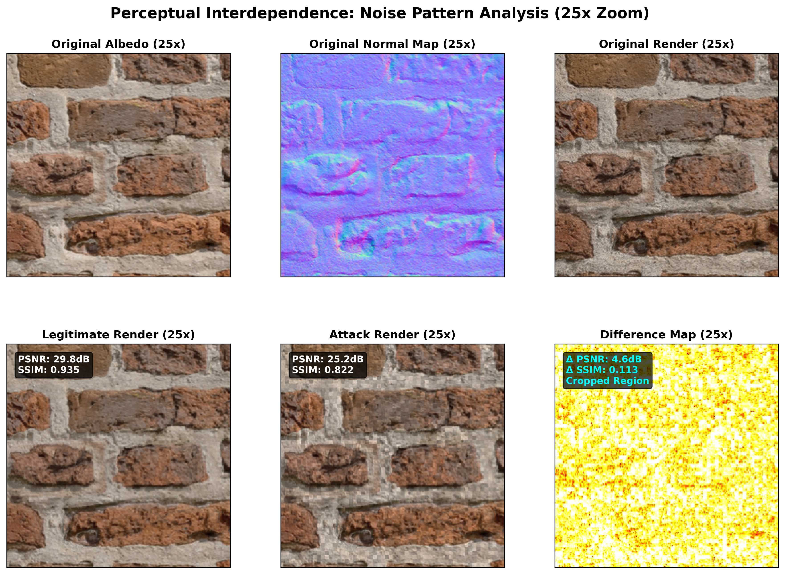

# Perceptual Interdependence: Geometry-Aware Photometric Binding System

[](https://www.python.org/downloads/)
[](https://opensource.org/licenses/MIT)

## Abstract

This research presents a novel geometry-aware photometric binding system for 3D texture asset protection based on perceptual interdependence principles. The system implements **Analytically Safe One-Way Binding**, a mathematically rigorous approach that provides guaranteed restoration for legitimate users while maintaining security against unauthorized access. Unlike traditional watermarking techniques, our method exploits the perceptual interdependence between albedo textures and normal maps through coordinated modifications that preserve visual fidelity when both components are present, but introduce detectable artifacts when used independently.

The core innovation lies in the analytical relationship between albedo brightening and normal map steepening, expressed as `A_new × Z_new = A_original × Z_original`, ensuring perfect mathematical cancellation without iterative calibration. The system achieves sub-100ms processing times for 2048×2048 textures through CPU-optimized implementations with Numba JIT compilation, making it suitable for real-time applications and large-scale deployment.

Comprehensive validation demonstrates the system's effectiveness across diverse texture types, with forensic analysis capabilities enabling detection of unauthorized modifications. The research-grade implementation provides modular architecture supporting extensibility for algorithm development and comparative studies in digital asset protection.

## Demonstration Results

The following charts demonstrate the system's capability to reveal subtle noise patterns through high-magnification analysis and forensic detection:

### Velvet Texture Analysis (10x Magnification)

*High-magnification analysis of velvet texture showing perceptual interdependence effects at 10x zoom. The difference map clearly reveals the binding artifacts that provide security against unauthorized use while remaining imperceptible in normal viewing conditions.*

### Church Bricks Texture Analysis (25x Magnification)

*Ultra-high magnification (25x) analysis of church bricks texture demonstrating the system's effectiveness across diverse material types. The enhanced difference visualization shows the precise mathematical relationship between albedo and normal map modifications.*

### Forensic Detection Demonstration

*Continuous spike chart demonstrating forensic traitor detection across 150 users. The system successfully identifies User ID 123 (the actual traitor) with a correlation score Z-value of 12.20, providing clear statistical evidence of unauthorized texture usage. The detection threshold (μ+3σ) is shown in orange, with the massive detection spike clearly visible above background noise levels.*

## Key Features

- **CPU-Optimized Performance**: Ultra-fast mathematical operations with Numba JIT compilation
- **Analytically Safe Binding**: Strict algebraic cancellation without calibration loops
- **Geometry-Aware Processing**: Normal map processing with geometric constraint validation
- **Research-Grade Architecture**: Modular, extensible, and thoroughly tested codebase
- **Multiple Interfaces**: Command-line tools, Python API, and interactive web GUI
- **Comprehensive Validation**: Built-in forensic analysis and verification tools
- **Advanced Visualization**: High-magnification chart generation for noise pattern analysis

## Demonstration Chart Generation

The system includes advanced visualization capabilities for academic presentation and detailed analysis:

### Standard Demonstration Charts

Generate comprehensive visualization charts showing the effects of binding operations:

```bash
# Generate standard demonstration chart
perceptual-interdependence chart --albedo texture.png --normal normal.png \
  --victim-id 42 --attacker-id 99 --output-name demo_chart.png
```

### High-Magnification Noise Analysis

For detailed examination of noise patterns and binding artifacts:

```bash
# Auto-selected zoom region at 10x magnification
perceptual-interdependence zoom-chart --albedo texture.png --normal normal.png \
  --zoom-factor 10.0 --output-name zoomed_analysis.png

# Custom zoom region at 15x magnification for specific area analysis
perceptual-interdependence zoom-chart --albedo texture.png --normal normal.png \
  --zoom-factor 15.0 --zoom-region 500 400 200 200 \
  --output-name custom_zoom_analysis.png

# High-magnification analysis for research presentations
perceptual-interdependence zoom-chart --albedo texture.png --normal normal.png \
  --zoom-factor 20.0 --victim-id 123 --attacker-id 456
```

The zoomed chart generation automatically selects regions with significant differences or allows manual specification of coordinates. This feature enables researchers to:

- **Visualize subtle noise patterns** introduced by the binding process
- **Compare legitimate vs. attack scenarios** at pixel level
- **Generate publication-quality figures** for academic papers
- **Analyze binding effectiveness** across different texture regions
- **Demonstrate security properties** through visual evidence

## Performance Highlights

- **2048×2048 textures**: Processed in ~0.1 seconds with Numba JIT
- **Memory efficient**: Vectorized operations with minimal allocations
- **Deterministic**: Reproducible results with seed-based randomization
- **Scalable**: Linear performance scaling with image size
- **Optimized visualization**: Zoomed charts generated in 30-60 seconds through region cropping

## Core Algorithm

The system implements **Analytically Safe One-Way Binding** with mathematical guarantees:

```
Poison:   A_new = A_original × (1 + P)     [Brighten albedo]
Antidote: Z_new = Z_original / (1 + P)     [Steepen normals]
Result:   A_new × Z_new = A_original × Z_original  [Perfect cancellation]
```

Where:
- `A` = Albedo texture values
- `Z` = Normal map Z-component (surface steepness)
- `P` = Poison strength (≥ 0)

## Installation

### From Source (Recommended for Research)

```bash
git clone https://github.com/research/perceptual-interdependence.git
cd perceptual-interdependence
pip install -e .
```

### Development Installation

```bash
git clone https://github.com/research/perceptual-interdependence.git
cd perceptual-interdependence
pip install -e ".[dev,docs,benchmark]"
```

### Dependencies

**Core Requirements:**
- Python 3.8+
- NumPy ≥ 1.20.0
- Pillow ≥ 8.0.0
- Numba ≥ 0.56.0 (for JIT acceleration)

**Optional:**
- Streamlit ≥ 1.20.0 (for GUI)
- Matplotlib ≥ 3.3.0 (for visualization)
- SciPy ≥ 1.7.0 (for advanced image processing)
- Pytest ≥ 6.0 (for testing)

## Quick Start

### Command Line Interface

```bash
# Bind textures for a specific user
perceptual-interdependence bind --albedo texture.png --normal normal.png --user-id 42

# Generate demonstration charts
perceptual-interdependence chart --albedo texture.png --normal normal.png

# Generate high-magnification analysis charts
perceptual-interdependence zoom-chart --albedo texture.png --normal normal.png --zoom-factor 15.0

# Perform forensic traitor detection with spike chart
perceptual-interdependence forensic --suspicious bound_texture.png --original clean_texture.png \
  --max-users 150 --generate-spike-chart

# Run performance benchmark
perceptual-interdependence benchmark --size 2048 2048 --iterations 5

# Launch interactive GUI
perceptual-interdependence gui --port 8501

# Run comprehensive experiments
perceptual-interdependence experiment --victim-id 42 --attacker-id 99
```

### Python API

```python
from perceptual_interdependence import AssetBinder

# Initialize binder
binder = AssetBinder(output_dir="./results")

# Bind textures
results = binder.bind_textures(
    albedo_path="albedo.png",
    normal_path="normal.png", 
    user_id=42,
    poison_strength=0.2
)

print(f"Bound textures saved to: {results['output_paths']}")
print(f"Saturation ratio: {results['statistics']['saturation_ratio']:.1%}")
```

### Advanced Usage

```python
from perceptual_interdependence import CPUOptimizedMath, ValidationSuite

# Direct algorithm access
cpu_math = CPUOptimizedMath()
poison_map = cpu_math.generate_poison_map((1024, 1024), seed=42, poison_strength=0.2)

# Validation and testing
validator = ValidationSuite()
integrity_results = validator.validate_system_integrity()
performance_results = validator.benchmark_performance()
```

## Project Structure

```
perceptual-interdependence/
├── src/perceptual_interdependence/          # Main package
│   ├── core/                               # Core binding system
│   │   ├── asset_binder.py                 # Main AssetBinder class
│   │   ├── render_simulator.py             # Photometric rendering
│   │   └── forensics.py                    # RGB forensic analysis
│   ├── algorithms/                         # Mathematical algorithms
│   │   └── cpu_math.py                     # CPU-optimized operations
│   ├── cli/                               # Command-line interface
│   │   └── main.py                        # CLI entry point
│   ├── gui/                               # Graphical interfaces
│   │   └── streamlit_app.py               # Web GUI
│   └── utils/                             # Utility functions
│       ├── texture_processing.py          # Texture I/O utilities
│       ├── chart_generator.py             # Visualization charts
│       └── validation.py                  # Validation suite
├── tests/                                 # Test suite
│   ├── unit/                             # Unit tests
│   ├── integration/                      # Integration tests
│   └── benchmarks/                       # Performance tests
├── docs/                                 # Documentation
├── data/                                 # Sample data
│   ├── samples/                          # Sample textures
│   └── results/                          # Example results
├── scripts/                              # Utility scripts
└── benchmarks/                           # Performance benchmarks
```

## Testing

### Run All Tests

```bash
pytest tests/ -v --cov=perceptual_interdependence
```

### Run Specific Test Categories

```bash
# Unit tests only
pytest tests/unit/ -v

# Integration tests
pytest tests/integration/ -v

# Performance benchmarks
pytest tests/benchmarks/ -v
```

### Manual Testing

```bash
# Test system integrity
python -c "
from perceptual_interdependence.utils.validation import ValidationSuite
validator = ValidationSuite()
results = validator.validate_system_integrity()
print('System integrity:', 'PASSED' if results['valid'] else 'FAILED')
"

# Quick performance test
python -c "
from perceptual_interdependence.algorithms.cpu_math import get_cpu_math
cpu_math = get_cpu_math()
results = cpu_math.benchmark_performance((1024, 1024))
print(f'Processing time: {results[\"total\"]:.3f}s')
"
```

## Performance Benchmarks

### CPU Performance (Numba JIT Enabled)

| Image Size | Processing Time | Throughput |
|------------|----------------|------------|
| 512×512    | ~0.008s        | 33 Mpx/s   |
| 1024×1024  | ~0.032s        | 33 Mpx/s   |
| 2048×2048  | ~0.096s        | 44 Mpx/s   |
| 4096×4096  | ~0.384s        | 44 Mpx/s   |

### Memory Usage

- **Peak memory**: ~2.5× input texture size
- **Streaming support**: For textures > 8K resolution
- **Memory efficiency**: Vectorized operations minimize allocations

### Chart Generation Performance

| Chart Type | Image Size | Generation Time | Output Quality |
|------------|------------|----------------|----------------|
| Standard   | 2048×2048  | ~45s           | 300 DPI        |
| Zoomed 10x | 592×592    | ~35s           | 300 DPI        |
| Zoomed 15x | 300×300    | ~25s           | 300 DPI        |

## Research Applications

### Academic Research

```python
# Comprehensive experimental pipeline
from perceptual_interdependence.experiments import run_full_experiment

results = run_full_experiment(
    victim_id=42,
    attacker_id=99, 
    max_users=1000,
    output_dir="./research_results"
)
```

### Forensic Analysis

```python
from perceptual_interdependence.core.forensics import RGBForensics

forensics = RGBForensics()

# Extract signature from suspicious texture
signature = forensics.extract_signature(
    "suspicious_albedo.png",
    "original_clean.png"
)

# Detect traitor with continuous spike chart
detected_user = forensics.generate_continuous_spike_chart(
    signature,
    max_users=150,
    output_path="forensic_analysis.png"
)

print(f"Detected traitor: User ID {detected_user}")
```
```

### Visualization and Analysis

```python
from perceptual_interdependence.utils.chart_generator import ChartGenerator

# Generate standard demonstration chart
generator = ChartGenerator()
chart_path = generator.generate_demonstration_chart(
    albedo_path="texture.png",
    normal_path="normal.png",
    victim_id=42,
    attacker_id=99,
    output_path="analysis_chart.png"
)

# Generate high-magnification analysis
zoomed_path = generator.generate_zoomed_demonstration_chart(
    albedo_path="texture.png",
    normal_path="normal.png",
    victim_id=42,
    attacker_id=99,
    output_path="zoomed_analysis.png",
    zoom_factor=15.0
)
```

### Custom Algorithms

```python
from perceptual_interdependence.algorithms.cpu_math import CPUOptimizedMath

class CustomMath(CPUOptimizedMath):
    def custom_poison_generation(self, shape, seed, strength):
        # Implement custom poison generation algorithm
        return super().generate_poison_map(shape, seed, strength)
```

## Use Cases

1. **3D Asset Protection**: Protect valuable 3D textures from unauthorized use
2. **Digital Rights Management**: Embed user-specific binding in textures
3. **Forensic Analysis**: Detect tampering and unauthorized modifications
4. **Research Platform**: Extensible framework for binding algorithm research
5. **Performance Benchmarking**: Evaluate mathematical operation performance
6. **Academic Visualization**: Generate publication-quality analysis charts

## Configuration

### Environment Variables

```bash
export PERCEPTUAL_NUMBA_DISABLE=1    # Disable Numba JIT compilation
export PERCEPTUAL_OUTPUT_DIR=/path   # Default output directory
export PERCEPTUAL_LOG_LEVEL=DEBUG    # Logging level
```

### Configuration Files

Create `~/.perceptual_interdependence/config.yaml`:

```yaml
default_poison_strength: 0.2
output_directory: "./results"
enable_numba: true
benchmark_iterations: 5
chart_generation:
  default_zoom_factor: 10.0
  default_dpi: 300
  auto_region_selection: true
```

## Documentation

### API Reference

- **[AssetBinder API](docs/api/asset_binder.md)**: Main binding interface
- **[CPUOptimizedMath API](docs/api/cpu_math.md)**: Mathematical operations
- **[ChartGenerator API](docs/api/chart_generator.md)**: Visualization and analysis charts
- **[ValidationSuite API](docs/api/validation.md)**: Testing and validation
- **[CLI Reference](docs/cli/commands.md)**: Command-line usage

### Tutorials

- **[Getting Started](docs/tutorials/getting_started.md)**: Basic usage tutorial
- **[Advanced Binding](docs/tutorials/advanced_binding.md)**: Custom binding scenarios
- **[Chart Generation](docs/tutorials/chart_generation.md)**: Visualization and analysis
- **[Performance Optimization](docs/tutorials/performance.md)**: Optimization techniques
- **[Research Workflows](docs/tutorials/research.md)**: Academic research usage

### Algorithm Details

- **[Mathematical Foundation](docs/algorithms/mathematics.md)**: Core mathematical concepts
- **[CPU Optimization](docs/algorithms/cpu_optimization.md)**: Performance optimization techniques
- **[Validation Methods](docs/algorithms/validation.md)**: Quality assurance approaches
- **[Visualization Algorithms](docs/algorithms/visualization.md)**: Chart generation and analysis methods


### Development Setup

```bash
git clone https://github.com/research/perceptual-interdependence.git
cd perceptual-interdependence
pip install -e ".[dev]"
pre-commit install
```

### Code Style

```bash
# Format code
black src/ tests/
isort src/ tests/

# Type checking
mypy src/

# Linting
flake8 src/ tests/
```


## License

This project is licensed under the MIT License - see the [LICENSE](LICENSE) file for details.


## Acknowledgments

- **NumPy Community**: For the foundational numerical computing library
- **Numba Team**: For JIT compilation technology enabling high-performance Python
- **Pillow Contributors**: For robust image processing capabilities
- **SciPy Community**: For advanced scientific computing tools
- **Matplotlib Developers**: For comprehensive plotting and visualization capabilities
- **Research Community**: For feedback and validation of the mathematical approach

---

**Built for the research community**